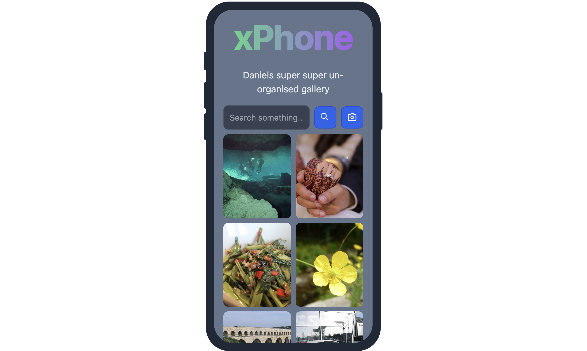

## This is a Multimodal Search demo built with [Weaviate](https://weaviate.io), [Vertex AI](https://openai.com/research/clip) and [Nuxt.js](https://nuxt.com/) 

👨🏾‍🍳 Blogpost - [Building Multimodal AI in TypeScript
](https://weaviate.io/blog/multimodal-search-in-typescript)



## 🐥 Getting Started

First, clone the project with the command below

```bash
git clone https://github.com/malgamves/flick-picker
```

The repository lets us do three things
1. Run the Nuxt.js Web App.
2. Import images, and text into your Weaviate database.
3. Search like it's 2034! 


### 🏗️ Create a Weaviate Instance

Create a Weaviate instance on Weaviate Cloud Services as described in [this guide](https://weaviate.io/developers/weaviate/quickstart#step-2-create-an-instance)

### 🦿 Create a `.env` file and add the following keys

- your Google Vertex API key as `NUXT_VERTEX_API_KEY` (you can get this in your [Vertex AI settings](https://console.cloud.google.com/apis/credentials))
- your Open AI API key as `NUXT_OPENAI` (you can get this in your [Open AI settings](https://platform.openai.com/account/api-keys))
- your Weaviate API key as `NUXT_WEAVIATE_API_KEY` (you can get this in your [Weaviate dashboard](https://console.weaviate.cloud/dashboard) under sandbox details)
- your Weaviate host URL as `NUXT_WEAVIATE_URL` (you can get this in your [Weaviate dashboard](https://console.weaviate.cloud/dashboard) under sandbox details)


### 📩 Importing Data
> Before you can import data, add any files to their respective media type in the `public/` folder. You will have to download a dataset of [movie posters](https://drive.google.com/drive/folders/1BKLJmIt9YD0rTGImrHeUc91io5RjGm_l?usp=sharing) and place them in `/public/image`.

With your data in the right folder, run `yarn install` to install all project dependencies and to import your data into Weaviate and initialize a collection, run:
```bash
yarn run import
```

this may take a minute or two.


### 🚀 Running your Nuxt.js Application.
> Make sure you have your Weaviate instance running with data imported before starting your Nuxt.js Web App.

To run the Web App
```bash
yarn dev
```

... and you can search away!! 


### 📚 Resources

Learn more about multimodal applications
- [Multimodal Retrieval Augmented Generation(RAG)](https://weaviate.io/blog/multimodal-rag)
- [Multimodal Embedding Models](https://weaviate.io/blog/multimodal-models)


### 🤷🏾‍♂️ Troubleshooting

- Check out the [Weaviate Docs](https://weaviate.io/developers/weaviate)
- [Open an Issue](https://github.com/malgamves/next-multimodal-search-demo/issues)


Some credit goes to Steven for his [Spirals template](https://github.com/steven-tey/spirals)

